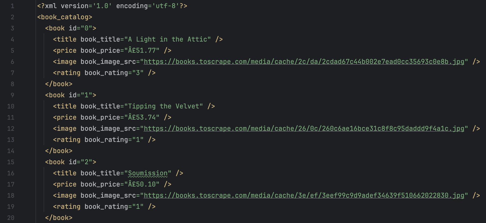

#  Web Scraper (Python + BeautifulSoup)

Educational project that demonstrates how to extract structured data from web pages using **Python requests + BeautifulSoup**.

---

##  Project Goal

Collect product data from a website and save it into a structured format (XML).  
This mimics a real business case: automation of data collection (prices, images, ratings).

---

##  Features

- Sends HTTP request to a website
- Parses HTML and extracts:
  - Product title
  - Price
  - Rating
  - Image URL
- Saves parsed data into **XML file**
- Logs progress in console

---

## ️ Tech Stack

| Tool / Library      | Purpose |
|---------------------|---------|
| Python 3.10+        | Main language |
| `requests`          | Sending HTTP requests |
| `BeautifulSoup`     | Parsing HTML |
| `xml.etree.ElementTree` | Saving data as XML |

---

##  Project Structure

/Parser
│── main.py # main script
│── readme_img/ # screenshots for README
└── README.md


---

##  Screenshot of Output


### Example of generated **XML file**:



---

##  How to run

```bash
# Create virtual environment
python3 -m venv venv

# Activate (Mac / Linux)
source venv/bin/activate

# Activate (Windows)
venv\Scripts\activate

# Install dependencies
pip install -r requirements.txt

# Run
python main.py

